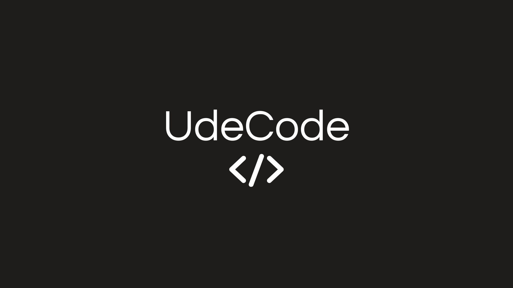

# SPIR: Solución de IA para gategroup (HackMTY 2025)

\<p align="center"\>
\
\</p\>

## 📜 Índice

1.  (\#-descripción-del-proyecto)
2.  [✨ Características Principales](#-características-principales)
3.  (\#️-stack-tecnológico-y-estructura)
4.  [🚀 Cómo Correr el Proyecto](#-cómo-correr-el-proyecto)
5.  (\#-guía-de-ramas-y-flujo-de-trabajo)
6.  [👥 Equipo](#-equipo)

## 📝 Descripción del Proyecto

Este es un prototipo funcional desarrollado para el reto **"Pick & Pack of the Future"** de gategroup, enfocado en resolver los desafíos del pilar **Smart Intelligence**: `Consumption Prediction` y `Productivity Estimation`. [1]

### El Problema

El modelo operativo actual de gategroup es reactivo, lo que genera dos problemas críticos:

  - **Desperdicio masivo:** Más del 50% de los productos regresan sin ser consumidos, ya que el inventario se carga basándose en especificaciones estáticas y no en la demanda real. [1]
  - **Productividad inconsistente:** La mala planificación de recursos causa cuellos de botella y una gran variabilidad en los tiempos de empaque. [1]

### Nuestra Solución: SPIR

Nuestra solución, **SPIR (Sistema de Planificación Inteligente de Recursos)**, ataca estos problemas transformando los datos agregados diarios (`Plant 1.csv`, `Plant 2.csv`) en una herramienta de inteligencia táctica. [1, 1]

  - **Motor de Forecasting:** Construimos un modelo de series temporales con **XGBoost** para predecir con alta precisión la carga de trabajo diaria (vuelos y pasajeros), cumpliendo el objetivo de \<2% de error solicitado. [1]
  - **Índice de Demanda Diaria (IDD):** Creamos un índice que convierte el pronóstico en un multiplicador de demanda fácil de entender (ej. `1.15` = 15% más carga de trabajo de lo normal).
  - **Aplicación Práctica:**
      - **Para el Inventario:** El IDD de pasajeros ajusta la cantidad de productos de la "Especificación Base" de cada vuelo.
      - **Para el Personal:** El IDD de vuelos recomienda el número óptimo de empleados para el turno.

## ✨ Características Principales

  - **Forecasting de Alta Precisión:** Predicción de la carga de trabajo diaria con un error menor al 2%.
  - **Optimización Dinámica de Inventario:** Reducción del desperdicio ajustando la carga de productos por vuelo.
  - **Planificación Inteligente de Personal:** Recomendación de empleados necesarios para estabilizar la productividad.
  - **Monorepo Optimizado para Hackathon:** Estructura de proyecto diseñada para prototipar y desplegar rápidamente.

## 🛠️ Stack Tecnológico y Estructura

Este proyecto está construido como un **Monorepo** para facilitar el desarrollo y despliegue rápido.

### 1\. Núcleo de Ciencia de Datos

  - **Lenguaje:** Python
  - **Librerías:** Pandas, NumPy, Scikit-learn, XGBoost
  - **Entorno:** Jupyter Notebooks para prototipado, empaquetados como servicios expuestos por el backend.

### 2\. Backend

  - **Framework:** FastAPI (Python)
  - **Base de Datos:** SQLAlchemy con SQLite (local) y soporte para Postgres (opcional).
  - **Testing:** Pytest

### 3\. Diseño y Frontend

  - **Diseño y Prototipado:** Figma
  - **Framework:** React + Vite (TypeScript)
  - **Componentes UI:** Material-UI (MUI)
  - **Cliente HTTP:** Axios

### 4\. Infraestructura y Herramientas

  - **Control de Versiones:** Git / GitHub
  - **Contenerización:** Docker / Docker Compose

## 🚀 Cómo Correr el Proyecto

Este proyecto está completamente contenerizado con Docker para una ejecución sencilla.

### ✅ Prerrequisitos

  - [Git](https://git-scm.com/)
  - ([https://www.docker.com/products/docker-desktop/](https://www.docker.com/products/docker-desktop/))

### ⚙️ Pasos para la Ejecución

1.  \*\*Clonar el Repositorio:\*\*bash
    git clone [https://github.com/tu-usuario/tu-repositorio.git](https://github.com/tu-usuario/tu-repositorio.git)
    ```
    ```
2.  **Navegar al Directorio:**
    ```bash
    cd tu-repositorio
    ```
3.  **Levantar los Contenedores:**
    ```bash
    docker-compose up --build
    ```
4.  **¡Listo\! El proyecto está corriendo:**
      - **Frontend (App):** `http://localhost:3000`
      - **Backend (API Docs):** `http://localhost:8000/docs`

## 🌿 Guía de Ramas y Flujo de Trabajo

  - **`main`**: Versión de producción. Siempre estable.
  - **`develop`**: Rama de integración. Base para todo nuevo desarrollo.
  - **`feature/nombre-descriptivo`**: Para desarrollar cada nueva funcionalidad.

Todo el trabajo se realiza en ramas `feature` que salen de `develop` y se integran de nuevo a través de **Pull Requests**.

## 👥 Equipo

  - Edson Manuel Zepeda Chávez
  - Eric Bojado Flores
  - Itzel Alejandra Lesama Apolinar
  - Julian Martinez Larios

<!-- end list -->

```
```